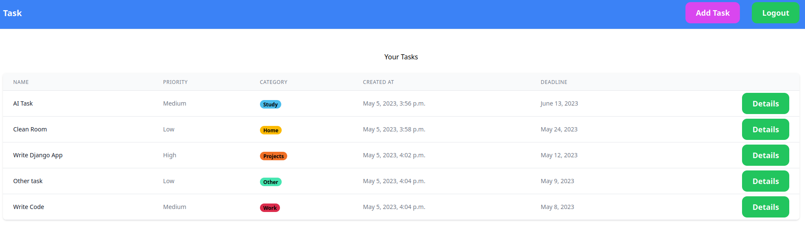

# Task Manager
Task Manager is a program written in Python using the Django Framework,Django Templates and Tailwind CSS. The application allows for creating user accounts, logging into the service, and adding/editing/deleting tasks. I created this application for my own personal use. 
## Clone App
```console
    $ git clone https://github.com/x4trm/task-manager.git
```
or
```console
    $ git clone git@github.com:x4trm/task-manager.git
```
## Run App
### Create Virtual Environment
```console
    $ python3 -m venv venv
```
### Activate the Virtual Environment (Unix or Windows)
#### Unix
```console
    $ source venv/bin/activate
```
#### Windows
```console
    > .\venv\Scripts\activate.bat
```
#### Install Dependencies
```console
    $ pip install -r requirements.txt
```
#### Run
```console
    $ python3 manage.py runserver
```
### Open your browser and go to:
127.0.0.1:8000/

## App Screen


## Dev Plans
1.  Adding colored priorities  
2.  Adding sorting task
3.  Adding notifications for approaching deadlines